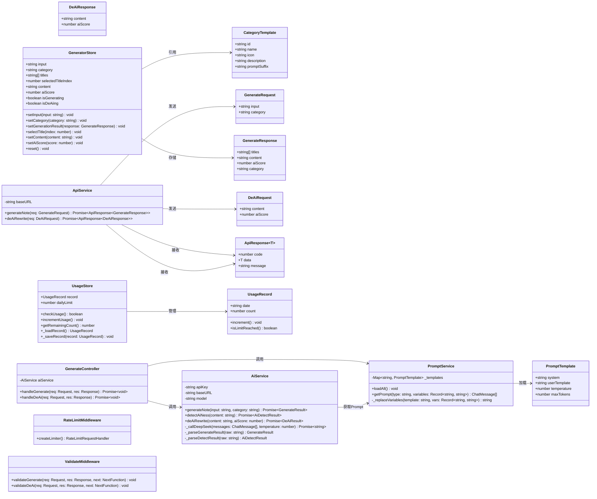
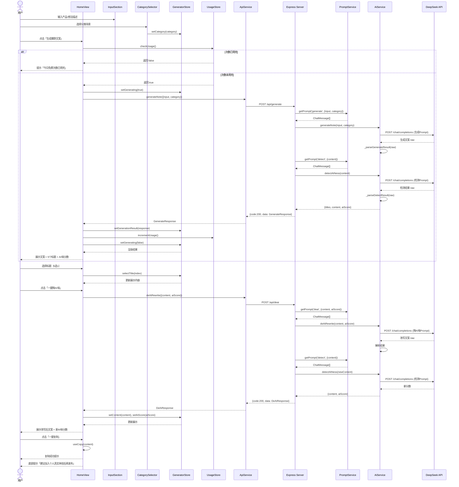
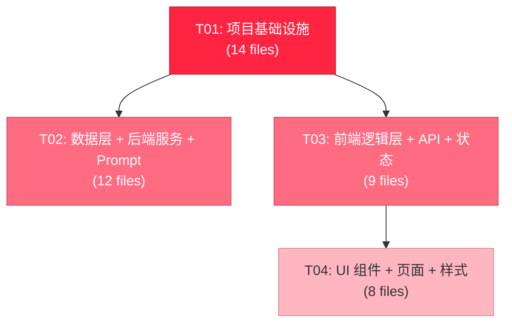

# 笔记侠 — 小红书爆款文案生成器 系统架构设计

> 架构师：高见远（Gao） | 版本：v1.0 | 日期：2025-07

---

## Part A: 系统设计

---

### 1. 实现方案与框架选型

#### 1.1 核心技术挑战

| 挑战 | 说明 | 应对策略 |
|------|------|----------|
| DeepSeek API 流式响应 | 生成文案耗时 3-10s，需避免用户感知卡顿 | 后端聚合完整响应后返回；前端用 loading 动画 + 骨架屏 |
| Prompt 模板迭代 | 三套核心 Prompt 需频繁优化 | 独立 JSON 配置文件，热加载无需重启 |
| AI味检测精度 | 检测 Prompt 返回结构化评分需稳定解析 | 后端解析 + 校验，兜底默认分数 |
| 免费次数防刷 | localStorage 可被用户清除 | MVP 阶段接受此限制，服务端加 IP 级限流兜底 |
| 移动端体验 | H5 在手机浏览器打开，需触控友好 | 移动端优先设计，大按钮、大输入框、底部操作栏 |
| API 密钥安全 | DeepSeek API Key 不能暴露到前端 | 所有 AI 调用走后端代理，前端不接触密钥 |

#### 1.2 框架选型（遵循 PRD 已确定技术栈）

| 层次 | 技术 | 版本 | 选型理由 |
|------|------|------|----------|
| 前端框架 | Vue 3 (Composition API) | ^3.4 | PRD 指定；Composition API 逻辑复用性强 |
| 构建工具 | Vite | ^5.4 | PRD 指定；HMR 极速，开箱即用 |
| CSS 方案 | Tailwind CSS | ^3.4 | 移动端优先原子类，粉白主题快速定制 |
| 状态管理 | Pinia | ^2.1 | Vue 3 官方推荐，TS 友好，轻量 |
| 路由 | Vue Router | ^4.3 | SPA 路由管理 |
| 后端框架 | Express | ^4.19 | PRD 指定；成熟稳定，中间件生态丰富 |
| AI 模型 | DeepSeek V4 Flash | — | PRD 指定；性价比极高（¥0.002/次） |
| HTTP 客户端 | axios | ^1.7 | 前后端统一，拦截器机制成熟 |
| 后端限流 | express-rate-limit | ^7.2 | IP 级限流，防滥用 |
| 环境变量 | dotenv | ^16.4 | 后端 .env 管理 |

#### 1.3 架构模式

```
┌─────────────────────────────────────────────────────┐
│                    Browser (H5)                      │
│  ┌───────────────────────────────────────────────┐   │
│  │          Vue 3 SPA (Composition API)          │   │
│  │  ┌─────────┐ ┌──────────┐ ┌──────────────┐  │   │
│  │  │  Views   │ │Components│ │  Composables  │  │   │
│  │  └────┬────┘ └────┬─────┘ └──────┬───────┘  │   │
│  │       └──────┬─────┘              │          │   │
│  │         ┌────┴────┐               │          │   │
│  │         │  Pinia   │               │          │   │
│  │         │  Stores  │               │          │   │
│  │         └────┬────┘               │          │   │
│  │              │                     │          │   │
│  │         ┌────┴─────────────────────┴──┐      │   │
│  │         │       API Service (axios)    │      │   │
│  │         └────────────┬────────────────┘      │   │
│  └──────────────────────┼───────────────────────┘   │
│                         │ HTTP                      │
└─────────────────────────┼───────────────────────────┘
                          ▼
┌─────────────────────────────────────────────────────┐
│              Express Backend (REST API)              │
│  ┌──────────┐  ┌───────────┐  ┌────────────────┐   │
│  │  Routes   │→│Controllers│→│   Services      │   │
│  └──────────┘  └───────────┘  └───────┬────────┘   │
│                                        │            │
│  ┌──────────┐  ┌───────────┐           │            │
│  │Middleware │  │  Config   │           │            │
│  │(rateLimit)│  │(env vars) │           │            │
│  └──────────┘  └───────────┘           │            │
│                                        ▼            │
│                              ┌─────────────────┐    │
│                              │  PromptService   │    │
│                              │  (JSON templates)│    │
│                              └────────┬────────┘    │
│                                       │             │
└───────────────────────────────────────┼─────────────┘
                                        ▼
                              ┌─────────────────┐
                              │ DeepSeek V4 API  │
                              │ (Flash)          │
                              └─────────────────┘
```

**核心模式**：
- **前后端分离**：Vue SPA ↔ Express REST API，通过 axios 通信
- **服务层模式**：Controller → Service → External API，职责清晰
- **模板方法模式**：PromptService 加载 JSON 模板并填充变量
- **Composable 复用**：前端逻辑抽取为 composable，组件只管渲染

---

### 2. 文件列表

```
app/
├── client/                              # 前端 Vue 3 项目
│   ├── index.html                       # HTML 入口
│   ├── package.json                     # 前端依赖声明
│   ├── vite.config.ts                   # Vite 构建配置（含代理）
│   ├── tailwind.config.js               # Tailwind 粉白主题配置
│   ├── tsconfig.json                    # TypeScript 配置
│   ├── postcss.config.js                # PostCSS 配置
│   ├── env.d.ts                         # 环境变量类型声明
│   ├── public/
│   │   └── favicon.ico                  # 网站图标
│   └── src/
│       ├── main.ts                      # Vue 应用入口
│       ├── App.vue                      # 根组件
│       ├── router/
│       │   └── index.ts                 # 路由配置
│       ├── stores/
│       │   ├── generator.ts             # 生成状态管理
│       │   └── usage.ts                 # 使用次数管理
│       ├── views/
│       │   └── HomeView.vue             # 首页（唯一页面）
│       ├── components/
│       │   ├── InputSection.vue         # 输入区域（输入框+分类选择）
│       │   ├── CategorySelector.vue     # 6大分类场景选择器
│       │   ├── TitleSelector.vue        # 5选1标题选择器
│       │   ├── OutputSection.vue        # 生成结果展示区
│       │   ├── AiScoreBar.vue           # AI味评分条
│       │   └── CopyButton.vue           # 一键复制按钮
│       ├── composables/
│       │   ├── useGenerate.ts           # 生成逻辑封装
│       │   ├── useAiDetect.ts           # AI味检测逻辑
│       │   ├── useCopy.ts               # 剪贴板复制逻辑
│       │   └── useUsageLimit.ts         # 免费次数限制逻辑
│       ├── services/
│       │   └── api.ts                   # 后端 API 调用封装
│       ├── types/
│       │   └── index.ts                 # TypeScript 类型定义
│       ├── constants/
│       │   └── categories.ts            # 6大分类常量定义
│       └── styles/
│           └── main.css                 # 全局样式 + Tailwind 指令
│
├── server/                              # 后端 Express 项目
│   ├── package.json                     # 后端依赖声明
│   ├── tsconfig.json                    # TypeScript 配置
│   ├── .env.example                     # 环境变量示例
│   └── src/
│       ├── index.ts                     # Express 应用入口
│       ├── config/
│       │   └── index.ts                 # 环境变量配置加载
│       ├── routes/
│       │   └── generate.ts              # 生成相关路由
│       ├── controllers/
│       │   └── generateController.ts    # 生成控制器
│       ├── services/
│       │   ├── aiService.ts             # DeepSeek API 调用服务
│       │   └── promptService.ts         # Prompt 模板加载服务
│       ├── middleware/
│       │   ├── rateLimit.ts             # IP 限流中间件
│       │   └── validate.ts             # 请求参数校验中间件
│       └── types/
│           └── index.ts                 # 后端 TypeScript 类型
│
├── server/prompts/                      # Prompt 模板（独立目录，方便迭代）
│   ├── generate.json                    # 爆款文案生成 Prompt
│   ├── detect.json                      # AI味检测 Prompt
│   └── deai.json                        # 降AI味 Prompt
│
└── docs/                                # 项目文档
    ├── ARCHITECTURE.md                  # 本文件
    ├── sequence-diagram.mermaid         # 时序图
    └── class-diagram.mermaid            # 类图
```

---

### 3. 数据结构与接口

#### 3.1 类图



#### 3.2 关键接口详细定义

**前端类型 — `client/src/types/index.ts`**

```typescript
/** 分类场景模板 */
export interface CategoryTemplate {
  id: string;            // 'beauty' | 'food' | 'fashion' | 'travel' | 'shopping' | 'store'
  name: string;          // '美妆' | '美食' | ...
  icon: string;          // emoji 图标
  description: string;   // 简短描述
  promptSuffix: string;  // 分类专属 Prompt 追加内容
}

/** 生成请求 */
export interface GenerateRequest {
  input: string;         // 用户输入的一句话
  category: string;      // 分类ID
}

/** 生成响应 */
export interface GenerateResponse {
  titles: string[];      // 5个爆款标题
  content: string;       // 完整排版文案（含emoji + 话题标签）
  aiScore: number;       // AI味评分 0-100
  category: string;      // 使用的分类
}

/** 降AI味请求 */
export interface DeAiRequest {
  content: string;       // 原始文案
  aiScore: number;       // 当前AI味分数
}

/** 降AI味响应 */
export interface DeAiResponse {
  content: string;       // 改写后文案
  aiScore: number;       // 改写后AI味分数
}

/** API 统一响应格式 */
export interface ApiResponse<T> {
  code: number;          // 200=成功, 4xx=客户端错误, 5xx=服务端错误
  data: T;
  message: string;
}

/** 使用次数记录（localStorage） */
export interface UsageRecord {
  date: string;          // YYYY-MM-DD 格式
  count: number;         // 当日已使用次数
}
```

**后端类型 — `server/src/types/index.ts`**

```typescript
/** DeepSeek Chat 消息 */
export interface ChatMessage {
  role: 'system' | 'user' | 'assistant';
  content: string;
}

/** Prompt 模板结构 */
export interface PromptTemplate {
  system: string;           // system prompt
  userTemplate: string;     // user prompt 模板，含 {{variable}} 占位符
  temperature: number;      // 生成温度
  maxTokens: number;        // 最大输出 token
}

/** DeepSeek API 响应 */
export interface DeepSeekResponse {
  id: string;
  choices: Array<{
    message: ChatMessage;
    finish_reason: string;
  }>;
  usage: {
    prompt_tokens: number;
    completion_tokens: number;
    total_tokens: number;
  };
}

/** 生成结果（内部） */
export interface GenerateResult {
  titles: string[];
  content: string;
  aiScore: number;
}

/** AI味检测结果（内部） */
export interface AiDetectResult {
  aiScore: number;         // 0-100
  summary: string;         // 检测说明
}

/** 降AI味结果（内部） */
export interface DeAiResult {
  content: string;
  aiScore: number;
}
```

---

### 4. 程序调用流程

#### 4.1 核心用户流程时序图



#### 4.2 API 接口定义

| 方法 | 路径 | 请求体 | 响应体 | 说明 |
|------|------|--------|--------|------|
| POST | `/api/generate` | `{input, category}` | `{code, data: GenerateResponse, message}` | 生成爆款文案 + AI味检测 |
| POST | `/api/deai` | `{content, aiScore}` | `{code, data: DeAiResponse, message}` | 降AI味重写 + 重新检测 |
| GET | `/api/health` | — | `{code:200, data:{status:"ok"}, message:""}` | 健康检查 |

---

### 5. 待明确事项 (UNCLEAR)

| # | 事项 | 当前假设 | 风险 |
|---|------|----------|------|
| 1 | DeepSeek V4 Flash 的准确 API endpoint 和参数格式 | 使用 `/chat/completions` 标准格式，model=`deepseek-chat` | 如 API 有变化需调整 |
| 2 | 三套核心 Prompt 的完整内容 | PRD 提及已验证可用，但未给出具体文本 | 需要实际 Prompt 文本填充到 JSON 模板 |
| 3 | 生成结果中标题和正文的分隔解析方式 | 假设 Prompt 指示模型返回 JSON 格式，后端解析 | 若模型输出不稳定需加 fallback |
| 4 | AI味评分低于 80 标红的阈值是否可调 | 当前硬编码 80 分 | 可考虑做成配置项 |
| 5 | 微信扫码登录（F7 P1）的实现细节 | MVP 不实现，预留接口 | 后续需微信开放平台申请 |
| 6 | Vercel + Railway 部署的具体配置 | 本架构不涉及部署脚本 | CI/CD 另行配置 |
| 7 | 生成文案中的 emoji 和话题标签是 Prompt 生成还是后端拼接 | 假设由 Prompt 指示模型直接输出 | 若效果不佳可改为后端拼接 |

---

## Part B: 任务分解

---

### 6. 依赖包列表

**前端（client/package.json）**

```
- vue@^3.4.0: 核心框架
- vue-router@^4.3.0: 路由管理
- pinia@^2.1.0: 状态管理
- axios@^1.7.0: HTTP 客户端
- @vitejs/plugin-vue@^5.0.0: Vite Vue 插件
- vite@^5.4.0: 构建工具
- tailwindcss@^3.4.0: 原子化 CSS
- postcss@^8.4.0: CSS 处理
- autoprefixer@^10.4.0: CSS 前缀
- typescript@^5.4.0: 类型系统
- vue-tsc@^2.0.0: Vue TypeScript 类型检查
```

**后端（server/package.json）**

```
- express@^4.19.0: Web 框架
- cors@^2.8.5: 跨域中间件
- dotenv@^16.4.0: 环境变量管理
- axios@^1.7.0: HTTP 客户端（调用 DeepSeek）
- express-rate-limit@^7.2.0: IP 限流
- typescript@^5.4.0: 类型系统
- tsx@^4.7.0: TypeScript 执行器
- @types/express@^4.17.0: Express 类型
- @types/cors@^2.8.0: CORS 类型
```

---

### 7. 任务列表（按依赖顺序）

#### T01: 项目基础设施

**说明**：搭建前后端项目骨架，包含所有配置文件、入口文件、依赖声明。这是后续所有任务的前提。

**源文件**：
- `client/package.json`
- `client/vite.config.ts`
- `client/tailwind.config.js`
- `client/tsconfig.json`
- `client/postcss.config.js`
- `client/index.html`
- `client/env.d.ts`
- `client/src/main.ts`
- `client/src/App.vue`
- `client/public/favicon.ico`
- `server/package.json`
- `server/tsconfig.json`
- `server/.env.example`
- `server/src/index.ts`

**依赖**：无

**优先级**：P0

**关键要点**：
- Vite 配置中设置开发代理 `/api` → `http://localhost:3000`
- Tailwind 配置粉白主题色（primary: #FF2442 小红书红, accent: #FFF0F5 粉色背景）
- Express 入口加载 cors、dotenv、路由、限流中间件
- `.env.example` 包含 `DEEPSEEK_API_KEY`、`DEEPSEEK_BASE_URL`、`PORT`

---

#### T02: 数据层 + 后端服务 + Prompt 模板

**说明**：实现后端核心逻辑——Prompt 模板加载、DeepSeek API 调用、请求校验、限流，以及前后端共享类型定义。

**源文件**：
- `client/src/types/index.ts`
- `server/src/types/index.ts`
- `server/src/config/index.ts`
- `server/src/services/aiService.ts`
- `server/src/services/promptService.ts`
- `server/src/controllers/generateController.ts`
- `server/src/routes/generate.ts`
- `server/src/middleware/rateLimit.ts`
- `server/src/middleware/validate.ts`
- `server/prompts/generate.json`
- `server/prompts/detect.json`
- `server/prompts/deai.json`

**依赖**：T01

**优先级**：P0

**关键要点**：
- PromptService 启动时从 `server/prompts/` 加载三个 JSON 模板到内存
- AiService 封装 DeepSeek API 调用，含错误重试（1次）、超时控制（30s）
- generateController 的 handleGenerate 内部串行调用 generate + detect
- handleDeAi 内部串行调用 deai + detect
- RateLimit: 每个 IP 每天 30 次请求
- validate: input 必填且 1-200 字，category 必须在 6 个枚举值内
- Prompt JSON 使用 `{{variable}}` 占位符语法

---

#### T03: 前端逻辑层 + API 对接 + 状态管理

**说明**：实现前端数据流——Pinia Store、Composable 逻辑、API 调用封装、路由配置、分类常量。

**源文件**：
- `client/src/stores/generator.ts`
- `client/src/stores/usage.ts`
- `client/src/services/api.ts`
- `client/src/composables/useGenerate.ts`
- `client/src/composables/useAiDetect.ts`
- `client/src/composables/useCopy.ts`
- `client/src/composables/useUsageLimit.ts`
- `client/src/constants/categories.ts`
- `client/src/router/index.ts`

**依赖**：T01（项目配置），参考 T02 的类型定义（但可并行开发）

**优先级**：P0

**关键要点**：
- generator store 管理 input、category、titles、content、aiScore、loading 状态
- usage store 基于 localStorage 管理每日免费次数（3次/天）
- useGenerate composable 调用 API 并更新 store
- useCopy 使用 `navigator.clipboard.writeText()` + fallback
- categories.ts 定义 6 个分类模板数据
- API 基地址通过 Vite 环境变量 `VITE_API_BASE_URL` 配置

---

#### T04: UI 组件 + 页面 + 样式

**说明**：实现所有 Vue 组件和页面视图，完成粉白主题 UI，组装最终页面。

**源文件**：
- `client/src/views/HomeView.vue`
- `client/src/components/InputSection.vue`
- `client/src/components/CategorySelector.vue`
- `client/src/components/TitleSelector.vue`
- `client/src/components/OutputSection.vue`
- `client/src/components/AiScoreBar.vue`
- `client/src/components/CopyButton.vue`
- `client/src/styles/main.css`

**依赖**：T01（项目配置），T03（Store 和 Composable）

**优先级**：P0

**关键要点**：
- 移动端优先设计，min-width: 375px，max-width: 768px 居中
- 粉白配色：主色 #FF2442，背景 #FFF0F5，卡片白色圆角阴影
- InputSection: textarea + 分类选择 + 生成按钮
- CategorySelector: 横向滚动 6 个分类卡片
- TitleSelector: 5 个标题卡片，点击选中高亮
- OutputSection: 文案展示 + AI评分 + 降AI味按钮 + 复制按钮
- AiScoreBar: 进度条样式，<80 分红色警示
- 底部合规提示文字
- Loading 状态使用骨架屏/脉冲动画

---

### 8. 共享知识（跨文件约定）

```
- API 响应统一格式: {code: number, data: T, message: string}
  - code=200 成功, code=400 参数错误, code=429 限流, code=500 服务端错误
- 所有日期使用 ISO 8601 格式 (YYYY-MM-DD)
- localStorage key 前缀: "xhs_copywriting_" (避免冲突)
  - 使用次数: "xhs_copywriting_usage"
- 前端 API 基地址: import.meta.env.VITE_API_BASE_URL (开发时走 Vite proxy)
- 后端环境变量: 通过 dotenv 从 .env 加载，不硬编码
- DeepSeek API 调用: 使用 chat/completions 端点，model 字段从环境变量读取
- Prompt 模板变量替换: 使用 {{variable}} 占位符，PromptService._replaceVariables() 处理
- 分类枚举值: 'beauty' | 'food' | 'fashion' | 'travel' | 'shopping' | 'store'
- AI味评分: 0-100 整数，<80 分标红，>=80 分绿色
- 免费次数: 每日3次，基于 localStorage 按日期重置
- 服务端限流: 每个 IP 每天 30 次请求 (express-rate-limit)
- 组件命名: PascalCase，文件名 PascalCase.vue
- composable 命名: useXxx，文件名 useXxx.ts
- Tailwind 自定义主题色:
  - primary: #FF2442 (小红书红)
  - accent: #FFF0F5 (粉色背景)
  - surface: #FFFFFF (卡片白)
```

---

### 9. 任务依赖图



**说明**：
- T01 是所有任务的基础，必须最先完成
- T02（后端）和 T03（前端逻辑）可并行开发，T03 仅依赖 T01 的项目配置
- T04（UI 组件）依赖 T03 的 Store 和 Composable，必须等 T03 完成
- T02 和 T04 之间无直接依赖，但集成调试需要两者都完成
